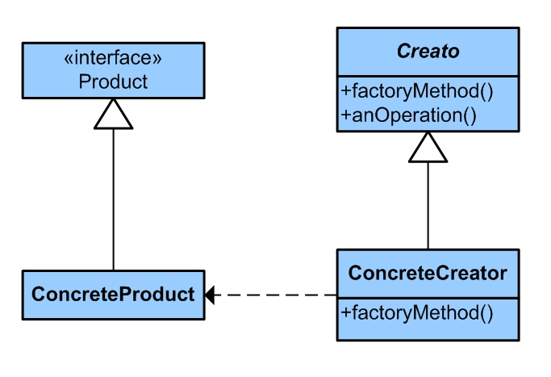
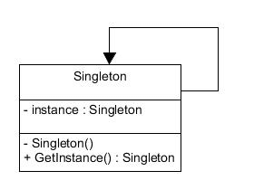

># **СЕМИНАР 2. Объектно-ориентированные паттерны.**
**Домашнее задание 1:**  Закончить разработку паттерна Фабричный метод.

>**Что реализовано:** Добавлена генерация объектов Sword, в том числе рандомное выпадение Long Sword и Sword

>**Код: https://github.com/Gregorian1489/HT002ARCHITECTURE-/tree/main/FabricPattern**

**Домашнее задание 2:** Познакомиться с другими типами паттернов (задание по желанию)

>**Для выполнения этого здания, я расссмотрел паттерн Singleton на примере реализации простой программы для логирования**.

>**Код: https://github.com/Gregorian1489/HT002ARCHITECTURE-/tree/main/SingletonPattern**

